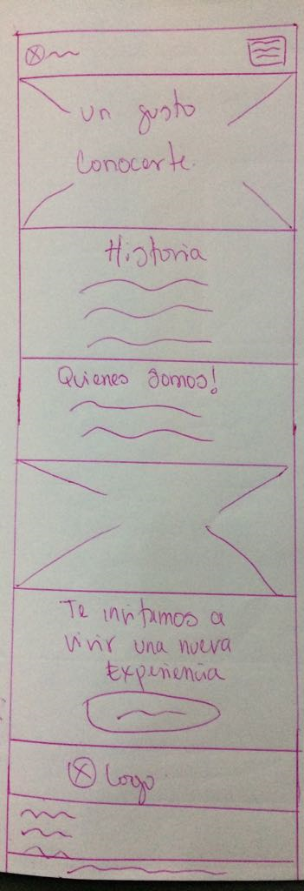

#Pre-Maquetado Página Acerca De Tía Tomate#
____

#### Tía Tomate es una empresa productora de tomates organicos que requiere maqueta para página "Acerca de"

####Los requerimientos visuales son:

- Que se muestre a sus clientes una pequeña reseña historica.
- Procedencia de sus productos.
- Mostrar personas que trabajan cosechando.
- Mostrar la pasión que sienten por sus productos.
- Mostrar logo.
- Enfocar la compra de productos.

###Los requerimientos tecnícos son:

- Que sea responsiva
 
###Sketch Página Acerca de para desktop:

###Sketch Página Acerca de para movil:

###Estructura de directorio:

	Tia-tomate
	 |__ assets
	 |	|__ css
	 |	|  |__ styles.css
	 |	|
	 |	|__ js
	 |	|  |__ scripts.js
	 |	|
	 |	|__ img
	 |	|  |__ imagenes 
	 |	|
	 |	|__ fonts
	 |	   |__ fuentes
	 |	
	 |__ index.html
	 |
	 |__ acerca_de.html
	 |
	 |__ productos.html
	 |
	 |__ blog.html
	 |
	 |__ contacto.html

###Estructura:

la pagina tendra la siguiente estructura:

- barra de navegación con logo.
- cuatro secciones.
- cuatro columnas.
- botón de compra.
- footer con logo, redes sociales y links posicionado dentro de grilla.

se usara bootstrap, a continuación se detalla estructura de html:

	<!DOCTYPE html>
	<html>
	<head>
	<meta charset="utf-8">
	<meta name="viewport" content="width=device-width, initial-scale=1 shrink-to-fit=no">
	<title>TIATOMATE | Acerca De</title>

	<!-- Bootstrap CSS -->
	<link rel="stylesheet" href="https://stackpath.bootstrapcdn.com/bootstrap/4.1.1/css/bootstrap.min.css" integrity="sha384-WskhaSGFgHYWDcbwN70/dfYBj47jz9qbsMId/iRN3ewGhXQFZCSftd1LZCfmhktB" crossorigin="anonymous">

	<!-- Main Styles -->
	<link rel="stylesheet" href="assets/css/style.css">
	</head>

	<body>
		<!-- Navbar -->
		
		<nav class="container navbar navbar-expand-lg navbar__tia-tomate fixed-top">
					
			<button class="navbar-toggler btn btn-link" type="button" data-toggle="collapse" data-target="#navbarTogglerDemo03" aria-controls="navbarTogglerDemo03" aria-expanded="false" aria-label="Toggle navigation">
			<svg xmlns="http://www.w3.org/2000/svg" viewBox="0 0 30 30" width="30" height="30" focusable="false"><title>Menu</title><path stroke="currentColor" stroke-width="2" stroke-linecap="round" stroke-miterlimit="10" d="M4 7h22M4 15h22M4 23h22"></path></svg>
			</button>

		<!-- Just Image-->

			
			
		<!-- Responsive Nav -->

			

				<ul class="nav navbar-nav navbar-right navbar__navigation">
					<li class="nav-item active">
						<a class="nav-link" href="acerca de.html">Acerca de(current)</a>
					</li>
					<li class="nav-item active">
						<a class="nav-link" href="Productos.html">Productos(current)</a>
					</li>
					<li class="nav-item active">
						<a class="nav-link" href="Blog.html">Blog</a>
					</li>
					<li class="nav-item active">
						<a class="nav-link" href="Contacto.html">Contacto</a>
					</li>
				</ul>
			
 <!--End items-->
		</nav>
		
		<!--Header-->
		<header class="container header__tia-tomate">
			<h1>Nosotros</h1>
		</header>
		
		<main>

		<!--Blog-->
		
			<section class="container blog">
			    

			      

			        <h2>Historia </h2>
			        
Esta historia nace hace unos años cuando la vida me brindó la oportunidad de recuperar los sabores a campo, olores a ciruelas y tierra mojada que consiguieron trasladarme a mi niñez. Volví a disfrutar del tomate. Si, ese que sabe y huele a tomate, ése tomate de vida tranquila que por su sabor sabes al comerlo que tiene su propia historia y, sin pretenderlo, pasas a formar parte de ella.

			        
			     

			     

					
<h2>Un Gusto Conocerte!</h2>

				

			    

			</section>
			
			<!--about us section-->

			<section class="container">
				

					
<h2>Quienes Somos</h2>

				

				

					

					
Fue así como nos adentramos en el fabuloso mundo del sabor. Miles de variedades, infinidad de cultivos desconocidos y un sinfín de maneras de cultivar. Nos propusimos recuperar variedades y buscar el sabor. Tomates de siempre, esos que “viajan mal” pero que mantienen el sabor a tradición, a las cosas bien hechas, a su ritmo y al del calor del sol que lo madura en la mata.

				

				

				

					

					

					<h5>Javiera Kunstmann</h5>
					
Defensores de lo auténtico, lo de siempre, lo natural y la sabiduría tradicional, buscamos la variedad y el sabor. Investigamos, probamos, compartimos y escuchamos.

					

					

					

					<h5>Roberto Pacheco</h5>
					
Todo con un único objetivo, conseguir cultivos sanos, naturales y orgánicos. Cultivos que nos beneficien a nosotros por salud, nos hagan disfrutar por sabor y que cuiden a la madre naturaleza, respetando sus ciclos de una forma natural. Sin olvidar nunca que el ritmo lo marca el campo.

					

				

			</section>

		<!-- purchase section -->

			<section>
				

				<h2>¡Te invitamos a vivir una nueva experiencia!</h2>
				<a class="btn button_tia-tomate" href="#">CLICK AQUÍ</a>
				

			</section>

		</main>

		<!-- footer -->

		<footer class="container footer_tia-tomate">
			

				

					
				

				

					

						<i class="fab fa-facebook fa-3x"></i>
						<i class="fab fa-instagram fa-3x"></i>
						<i class="fab fa-twitter fa-3x"></i>
					

				

				

					<ul class="nav flex-column">
						<li class="nav-item">
							<a class="nav-link active" href="#">Acerca de</a>
						</li>
						<li class="nav-item">
							<a class="nav-link" href="#">Productos</a>
						</li>
						<li class="nav-item">
							<a class="nav-link" href="#">Blog</a>
						</li>
						<li class="nav-item">
							<a class="nav-link" href="#">Contacto</a>
						</li>
					</ul>
				

			

			 <small>Tía Tomate 2018. Todos los derechos reservados.</small>
		</footer>

		<!-- Optional JavaScript -->

	    <!-- jQuery first, then Popper.js, then Bootstrap JS -->
	    

	    

	    

		<!-- font Awesome 5.1 -->
		<link rel="stylesheet" href="https://use.fontawesome.com/releases/v5.1.0/css/all.css" integrity="sha384-lKuwvrZot6UHsBSfcMvOkWwlCMgc0TaWr+30HWe3a4ltaBwTZhyTEggF5tJv8tbt" crossorigin="anonymous">

		<!-- main script -->
		
	</body>
	</html>

###Estilos:

se usaran 5 tipos de colores:

para fondos:

- #E56353
- #FAFAFA
- #707070

para letras:

- #696863
- #FFFFFF

se usaran 3 tipos de fuentes:

- Raleway-Bold.ttf
- Raleway-ExtraLight.ttf
- OpenSans-Regular.ttf

Imagenes se usaran las siguientes:

